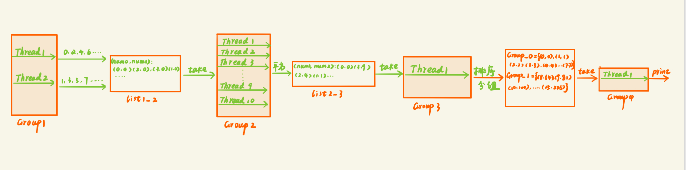

## 题目

有个类Data，有2个public成员变量num1和num2

一共4个线程组，
第一个线程组包含2个线程，线程0产生从0开始的偶数，线程1产生从1开始的奇数，都是递增产生，赋值给num1

第二个线程组有10个线程，他们的功能都是负责将组1的结果平方，赋值给num2，只要组1一有生成，组2就可以开始工作，组2每个线程需要随机休眠100-500毫秒

线程组3有1个线程，负责将组2的结果按顺序排列好并分组，只要有8个连续的数（比如0-7，8-15，第一个数必须是8的整数倍）就可以组成一个组发送给线程4，这个组的编号为当前组中第一个数除以8

第四个线程组有1个线程，负责按升序顺序将结果打印出来打印出来




```java
package multiple;

public class Data implements Comparable<Data> {
    public int num0;
    public int num1;

    @Override
    public String toString() {
        return "(" + num0 + ", " + num1 + ")";
    }

    @Override
    public int compareTo(Data o) {
        return this.num0 - o.num0;
    }
}

```

```java
package multiple;

import java.util.ArrayList;
import java.util.List;

public class Data1 {
    int num;
    List<Data> list = new ArrayList<>();
}

```

```java
package multiple;
import java.util.ArrayList;
import java.util.Collections;
import java.util.List;
import java.util.Random;
import java.util.concurrent.Semaphore;

public class Test {
    private static final boolean DEBUG = false;
    private static final Semaphore sharedSemaphore0 = new Semaphore(0, true);
    private static final Semaphore sharedSemaphore0_0 = new Semaphore(0, true);
    private static final Semaphore sharedSemaphore1 = new Semaphore(0, true);
    private static final Semaphore sharedSemaphore1_1 = new Semaphore(0, true);

    public static void sync(int num,Semaphore s0,Semaphore s1){
        Thread thread = new Thread(() -> {
            try {
                s0.acquire(num);
                s1.release(num);
            } catch (InterruptedException e) {
                e.printStackTrace();
            }
        });
        thread.start();
    }
    public static void sync1(Semaphore s0,Semaphore s1){
        s0.release();
        try {
            s1.acquire();
        } catch (InterruptedException e) {
            e.printStackTrace();
        }

    }
    private static class Generator implements Runnable {
        private List<Data> list;
        private int start;
        private int step;
        private int end;
        private final Semaphore semaphore;

        Generator(List<Data> list, int start, int step, int end, Semaphore semaphore) {
            this.list = list;
            this.start = start;
            this.step = step;
            this.end = end;
            this.semaphore = semaphore;
        }

        @Override
        public void run() {
            //两个线程交替产生0-100的整数，并添加到list
            for (int num = start; num <= end; num += step) {
                try {
                    Thread.sleep(10);
                } catch (InterruptedException e) {
                    e.printStackTrace();
                    break;
                }
                Data data = new Data();
                data.num0 = num;
                //list不是线程安全的，所以需要先获取锁
                synchronized (this.semaphore) {
                    list.add(data);
                    semaphore.release();
                    if (DEBUG) {
                        System.out.println(Thread.currentThread().getName() + " generate " + num);
                    }
                }
            }
            sync1(sharedSemaphore0,sharedSemaphore0_0);

            // send the end flag
            synchronized (this.semaphore) {
                if (list.size() == 0 || // for the customers have already consumed over
                        // for the end flag has been send by previous thread
                        list.get(list.size() - 1).num0 != Integer.MAX_VALUE) {
                    Data data = new Data();
                    data.num0 = Integer.MAX_VALUE;
                    list.add(data);
                    semaphore.release();
                }
            }
            if (DEBUG) {
                System.out.println(Thread.currentThread().getName() + ":Over...");
            }
        }
    }

    private static class Square implements Runnable {
        private List<Data> inList;
        private List<Data> outList;
        private final Semaphore lockIn;
        private final Semaphore lockOut;

        Square(List<Data> inList, List<Data> outList, Semaphore lock1, Semaphore lock2) {
            this.inList = inList;
            this.outList = outList;
            this.lockIn = lock1;
            this.lockOut = lock2;
        }

        @Override
        public void run() {
            boolean breakable = false;
            while (true) {
                try {
                    lockIn.acquire();
                } catch (InterruptedException e) {
                    e.printStackTrace();
                    break;
                }
                Data data;
                synchronized (this.lockIn) {
                    //如果list里面没有数据了
                    data = inList.get(0);
                    if (data.num0 == Integer.MAX_VALUE) {
                        // release for the others in group2 to stop themselves
                        lockIn.release();
                        breakable = true;
                    } else {
                        inList.remove(0);
                    }
                }
                if (!breakable) {
                    // simulation time-consuming operation
                    try {
                        data.num1 = data.num0 * data.num0;
                        Thread.sleep(new Random().nextInt(10) * 40 + 100);
                    } catch (InterruptedException e) {
                        e.printStackTrace();
                    }
                    synchronized (this.lockOut) {
                        outList.add(data);
                        lockOut.release();
                    }
                } else {
                    break;
                }
            }
            sync1(sharedSemaphore1,sharedSemaphore1_1);

            // send the end flag
            Data data = new Data();
            data.num0 = Integer.MAX_VALUE;
            synchronized (this.lockOut) {
                if (outList.size() == 0 || // for the customers have already consumed over
                        // for the end flag has been send by previous thread
                        outList.get(outList.size() - 1).num0 != Integer.MAX_VALUE) {
                    outList.add(data);
                    lockOut.release();
                }
            }
            if (DEBUG) {
                System.out.println(Thread.currentThread().getName() + ":Over...");
            }
        }
    }

    private static class GroupData implements Runnable {
        private List<Data> inList;
        private List<Data1> outList;
        private int groupSize;
        private final Semaphore lockIn;
        private final Semaphore lockOut;

        private List<Data1> tempList;

        GroupData(List<Data> inList, List<Data1> outList, int groupSize, Semaphore lockIn, Semaphore lockOut) {
            this.inList = inList;
            this.outList = outList;
            this.groupSize = groupSize;
            this.lockIn = lockIn;
            this.lockOut = lockOut;
            this.tempList = new ArrayList<>();
        }

        @Override
        public void run() {
            boolean breakable = false;
            while (true) {
                try {
                    lockIn.acquire();
                } catch (InterruptedException e) {
                    e.printStackTrace();
                }
                Data data;

                //判断inlist中还有没有数据
                synchronized (this.lockIn) {
                    data = inList.get(0);
                    if (data.num0 == Integer.MAX_VALUE) {
                        breakable = true;
                        lockIn.release();
                    } else {
                        inList.remove(0);
                    }
                }

                if (!breakable) {
                    Data1 currentGroup = null;

                    for (Data1 d : tempList) {
                        if (d.num == data.num0 / this.groupSize) {
                            currentGroup = d;
                            break;
                        }
                    }

                    //currentGroup如果为空，那么就将inlist.get(0)/8作为currentGroup的编号
                    if (currentGroup == null) {
                        currentGroup = new Data1();
                        currentGroup.num = data.num0 / this.groupSize;
                        tempList.add(currentGroup);
                    }

                    //然后将inlist.get(0)添加到currentGroup的list里面或者currentGroup不为空，就将inlist.get(0)添加进来
                    currentGroup.list.add(data);


                    if (currentGroup.list.size() == this.groupSize) {
                        synchronized (this.lockOut) {
                            Collections.sort(currentGroup.list);
                            outList.add(currentGroup);
                            lockOut.release();
                        }
                        tempList.remove(currentGroup);
                    }
                } else {
                    for (Data1 d : tempList) {
                        synchronized (this.lockOut) {
                            Collections.sort(d.list);
                            outList.add(d);
                            lockOut.release();
                        }
                    }
                    break;
                }
            }
            // send the end flag
            Data1 data = new Data1();
            data.num = Integer.MAX_VALUE;
            synchronized (this.lockOut) {
                if (outList.size() == 0 || outList.get(outList.size() - 1).num != Integer.MAX_VALUE) {
                    outList.add(data);
                    lockOut.release();
                }
            }
            if (DEBUG) {
                System.out.println(Thread.currentThread().getName() + ":Over...");
            }
        }
    }

    private static class Print implements Runnable {
        private List<Data1> list;
        private final Semaphore lock;
        private List<Data1> tempList;
        private int expect = 0;

        Print(List<Data1> list, Semaphore lock) {
            this.list = list;
            this.lock = lock;
            this.tempList = new ArrayList<>();
        }

        @Override
        public void run() {
            while (true) {
                try {
                    lock.acquire();
                } catch (InterruptedException e) {
                    e.printStackTrace();
                }
                synchronized (lock) {
                    Data1 data1 = list.get(0);
                    if (data1.num == Integer.MAX_VALUE) {
                        break;
                    }
                    list.remove(0);
                    tempList.add(data1);
                    for (int i = 0; i < tempList.size(); ) {
                        Data1 d = tempList.get(i);
                        if (d.num == expect) {
                            d.list.forEach(System.out::println);
                            expect++;
                            tempList.remove(d);
                        } else {
                            break;
                        }
                    }
                }
            }
            if (DEBUG) {
                System.out.println(Thread.currentThread().getName() + ":Over...");
            }
        }
    }


    public static void main(String[] args) {
        List<Data> list1_2 = new ArrayList<>();
        Semaphore semaphore1_2 = new Semaphore(0, true);

        List<Data> list2_3 = new ArrayList<>();
        Semaphore semaphore2_3 = new Semaphore(0, true);

        List<Data1> list3_4 = new ArrayList<>();
        Semaphore semaphore3_4 = new Semaphore(0, true);


        int max = 100;
        /*pipeline.Group 1*/
        {
            Thread gt0 = new Thread(new Generator(list1_2, 0, 2, max, semaphore1_2));
            gt0.setName("GeneratorThread0");
            gt0.start();

            Thread gt1 = new Thread(new Generator(list1_2, 1, 2, max, semaphore1_2));
            gt1.setName("GeneratorThread1");
            gt1.start();

            sync(2,sharedSemaphore0,sharedSemaphore0_0);

        }

        /*pipeline.Group 2*/
        {
            for (int i = 0; i < 10; i++) {
                Thread thread = new Thread(new Square(list1_2, list2_3, semaphore1_2, semaphore2_3));
                thread.setName("SquareThread" + i);
                thread.start();

            }
            sync(10,sharedSemaphore1,sharedSemaphore1_1);

        }

        /*pipeline.Group 3*/
        {
            Thread thread = new Thread(new GroupData(list2_3, list3_4, 8, semaphore2_3, semaphore3_4));
            thread.setName("GroupThread");
            thread.start();
        }

        /*pipeline.Group 4*/
        {
            Thread thread = new Thread(new Print(list3_4, semaphore3_4));
            thread.setName("PrintThread");
            thread.start();
        }
    }
}

```

