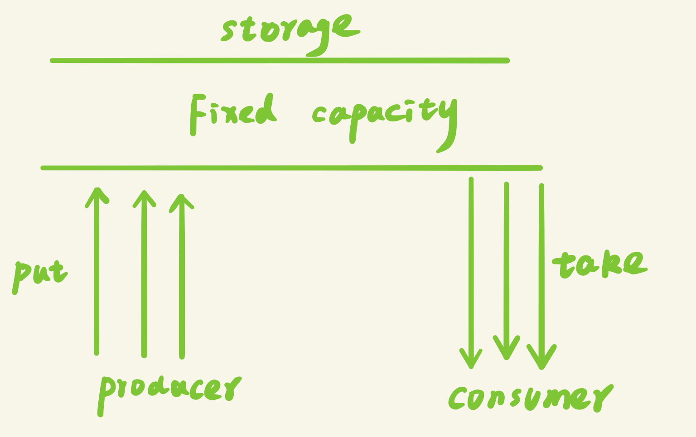
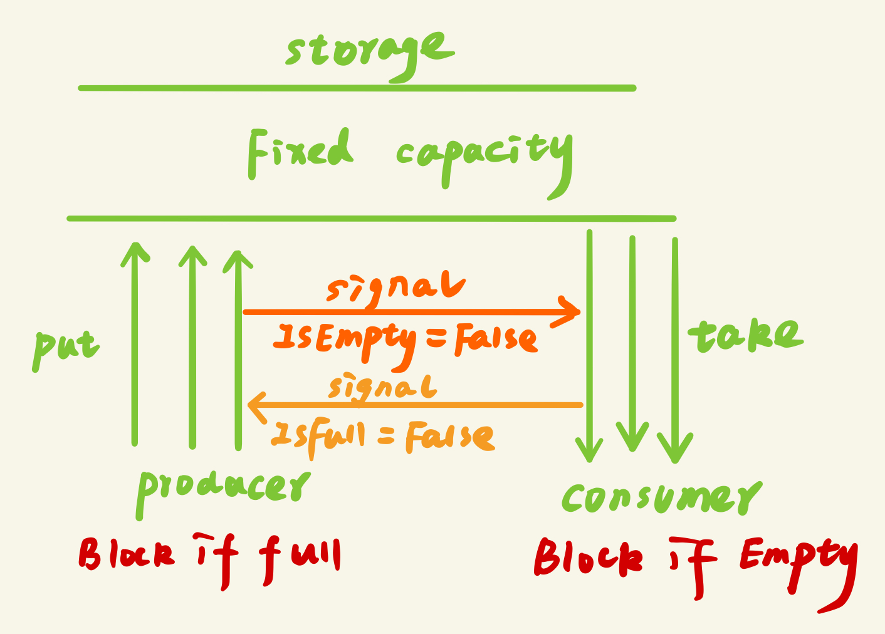
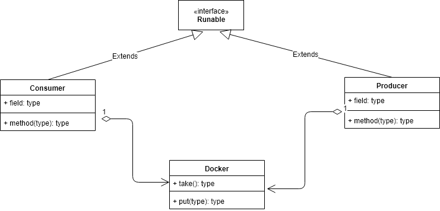

[TOC]

# 经典并发同步模式：生产者-消费者设计模式

​	在讨论基于阻塞队列的生产者消费者模式之前我们先搞清楚到底什么是生产者-消费者模式（producer-consumer模式）？

## 什么是生产者-消费者模式

比如有两个进程A和B，它们共享一个**固定大小的缓冲区**，A进程产生数据放入缓冲区，B进程从缓冲区中取出数据进行计算，那么这里其实就是一个生产者和消费者的模式，A相当于生产者，B相当于消费者



## 为什么要使用生产者消费者模式

在多线程开发中，如果生产者生产数据的速度很快，而消费者消费数据的速度很慢，那么生产者就必须等待消费者消费完了数据才能够继续生产数据，因为生产那么多也没有地方放啊；同理如果消费者的速度大于生产者那么消费者就会经常处理等待状态，所以为了达到生产者和消费者生产数据和消费数据之间的**平衡**，那么就需要一个缓冲区用来存储生产者生产的数据，所以就引入了生产者-消费者模式

简单来说这里的缓冲区的作用就是为了平衡生产者和消费者的处理能力，起到一个数据缓存的作用，同时也达到了一个解耦的作用

## 生产者-消费者模式的特点

- 保证生产者不会在缓冲区满的时候继续向缓冲区放入数据，而消费者也不会在缓冲区空的时候，消耗数据
- 当缓冲区满的时候，生产者会进入休眠状态，当下次消费者开始消耗缓冲区的数据时，生产者才会被唤醒，开始往缓冲区中添加数据；当缓冲区空的时候，消费者也会进入休眠状态，直到生产者往缓冲区中添加数据时才会被唤醒



## 生产者-消费者模式的应用场景

生产者-消费者模式一般用于将生产数据的一方和消费数据的一方分割开来，将生产数据与消费数据的过程解耦开来

- Excutor任务执行框架：

  - 通过将任务的提交和任务的执行解耦开来，提交任务的操作相当于生产者，执行任务的操作相当于消费者

  - 例如使用Excutor构建web服务器，用于处理线程的请求：生产者将任务提交给线程池，线程池创建线程处理任务，如果需要运行的任务数大于线程池的基本线程数，那么就把任务扔到阻塞队列（通过线程池+阻塞队列的方式比只使用一个阻塞队列的效率高很多，因为消费者能够处理就直接处理掉了，不用每个消费者都要先从阻塞队列中取出任务再执行）

- 消息中间件activeMQ: 

  - 双十一的时候，会产生大量的订单，那么不可能同时处理那么多的订单，需要将订单放入一个队列里面，然后由专门的线程处理订单。这里用户下单就是生产者，处理订单的线程就是消费者；再比如12306的抢票功能，先由一个容器存储用户提交的订单，然后再由专门处理订单的线程慢慢处理，这样可以在短时间内支持高并发服务

- 任务的处理时间比较长的情况下：

  - 比如上传附近并处理，那么这个时候可以将用户上传和处理附件分成两个过程，用一个队列暂时存储用户上传的附近，然后立刻返回用户上传成功，然后有专门的线程处理队列中的附近

## 生产者-消费者模式的优点

- 解耦：将生产者类和消费者类进行解耦，消除代码之间的依赖性，简化工作负载的管理
- 复用：通过将生产者类和消费者类独立开来，那么可以对生产者类和消费者类进行独立的复用与扩展
- 调整并发数：由于生产者和消费者的处理速度是不一样的，可以调整并发数，给予慢的一方多的并发数，来提高任务的处理速度
- 异步：对于生产者和消费者来说能够各司其职，生产者只需要关心缓冲区是否还有数据，不需要等待消费者处理完；同样的对于消费者来说，也只需要关注缓冲区的内容，不需要关注生产者，通过异步的方式支持高并发，将一个耗时的流程拆成生产和消费两个阶段，这样生产者因为执行put()的时间比较短，而支持高并发
- 支持分布式：生产者和消费者通过队列进行通讯，所以不需要运行在同一台机器上，在分布式环境中可以通过redis的list作为队列，而消费者只需要轮询队列中是否有数据。同时还能支持集群的伸缩性，当某台机器宕掉的时候，不会导致整个集群宕掉


## 生产者-消费者模式的实现

在实现生产者-消费者模式之前我们需要搞清两个问题：

- 如何保证容器中数据状态的一致性
- 如何保证消费者和生产者之间的同步和协作关系

1）容器中数据状态的一致性：当一个consumer执行了take()方法之后，此时容器为空，但是还没来得及更新容器的size,那么另外一个consumer来了之后以为size不等于0，那么继续执行take(),从而造成了了状态的不一致性

2）为了保证当容器里面没有数据的时候，消费者不会继续take，此时消费者释放锁，处于阻塞状态；并且一旦生产者添加了一条数据之后，此时重新唤醒消费者，消费者重新获取到容器的锁，继续执行take();

​	当容器里面满的时候，生产者也不会继续put, 此时生产者释放锁，处于阻塞状态；一旦消费者take了一条数据，此时应该唤醒生产者重新获取到容器的锁，继续put


所以对于该容器的任何访问都需要进行同步，也就是说在获取容器的数据之前，需要先获取到容器的锁。

而这里对于容器状态的同步可以参考如下几种方法：

（1）**Object**的wait() / notify()方法
（2）**Lock**和**Condition**的await() / signal()方法
（3）**BlockingQueue**阻塞队列方法
（4）**PipedInputStream** / **PipedOutputStream**

要构建一个生产者消费者模式，那么首先就需要构建一个固定大小的缓冲区，并且该缓冲区具有可阻塞的put方法和take方法

### Object的wait() / notify()方法

接下来我们采用第一种方法来实现该模型：使用Object的wait() / notify()方法实现生产者-消费者模型

ps:采用wait()/notify()方法的缺点是不能实现单生产者单消费者模式，因为要是用notify()就必须使用同步代码块

###### 创建Container容器类

```java
package test1;

import java.util.LinkedList;

public class Container {
    LinkedList<Integer> list = new LinkedList<Integer>();
    int capacity = 10;

    public void put(int value){
        while (true){
            try {
                //sleep不能放在同步代码块里面，因为sleep不会释放锁，
                // 当前线程会一直占有produce线程，直到达到容量，调用wait()方法主动释放锁
                Thread.sleep(1000);
            } catch (InterruptedException e) {
                e.printStackTrace();
            }
            synchronized (this){
                //当容器满的时候，producer处于等待状态
                while (list.size() == capacity){
                    System.out.println("container is full,waiting ....");
                    try {
                        wait();
                    } catch (InterruptedException e) {
                        e.printStackTrace();
                    }
                }
                //没有满，则继续produce
                System.out.println("producer--"+ Thread.currentThread().getName()+"--put:" + value);
                list.add(value++);
                //唤醒其他所有处于wait()的线程，包括消费者和生产者
                notifyAll();
            }
        }
    }

    public Integer take(){
        Integer val = 0;
        while (true){
            try {
                Thread.sleep(1000);
            } catch (InterruptedException e) {
                e.printStackTrace();
            }
            synchronized (this){
                //如果容器中没有数据，consumer处于等待状态
                while (list.size() == 0){
                    System.out.println("container is empty,waiting ...");
                    try {
                        wait();
                    } catch (InterruptedException e) {
                        e.printStackTrace();
                    }
                }
                //如果有数据，继续consume
                val = list.removeFirst();
                System.out.println("consumer--"+ Thread.currentThread().getName()+"--take:" + val);

                //唤醒其他所有处于wait()的线程，包括消费者和生产者
                //notify必须放在同步代码块里面
                notifyAll();
            }
        }


    }

}

```

ps: 

- sleep()的位置

这里需要注意的是sleep()不能放在synchronized代码块里面，因为我们知道sleep()执行之后是不会释放锁的，也就是说当前线程仍然持有对container对象的互斥锁，这个时候当前线程继续判断list.size是否等于capacity，不等于就继续put,然后又sleep一会，然后又继续，直到当list.size == capacity,这个时候终于进入wait()方法，我们知道wait()方法会释放锁，这个时候其他线程才有机会获取到container的互斥锁，

- notifyAll()不能单独放在producer类里面，因为notifyAll（）必须放在同步代码块里面
- 弊端：这里由于不能区分哪些是not empty或者not full或者is full/empty线程，所以需要唤醒所有其他等待的线程，但实际上我们需要的是唤醒那些not empty或者not full的线程就够了

###### 创建生产者类

```java
package test1;
import test1.Container;
import java.util.Random;

public class Producer implements Runnable{
    private Container container;
    public Producer(Container container) {
        this.container = container;
    }
    @Override
    public void run() {
        container.put(new Random().nextInt(100));
    }
}

```

###### 创建消费者类

```java
package test1;
import java.util.Random;

public class Consumer implements Runnable{
    private Container container;
    public Consumer(Container container) {
        this.container = container;
    }

    @Override
    public void run() {
        Integer val = container.take();
    }
}

```

###### 测试类

```java
package test1;

import test1.Consumer;
import test1.Container;
import test1.Producer;

public class Main {
    public static void main(String[] args){
        Container container = new Container();

        Thread producer1 = new Thread(new Producer(container));
        Thread producer2 = new Thread(new Producer(container));
        Thread producer3 = new Thread(new Producer(container));
        Thread producer4 = new Thread(new Producer(container));
        producer1.start();
        producer2.start();
        producer3.start();
        producer4.start();

        Thread consumer1 = new Thread(new Consumer(container));
        Thread consumer2 = new Thread(new Consumer(container));
        Thread consumer3 = new Thread(new Consumer(container));
        Thread consumer4 = new Thread(new Consumer(container));
        Thread consumer5 = new Thread(new Consumer(container));
        Thread consumer6 = new Thread(new Consumer(container));
        consumer1.start();
        consumer2.start();
        consumer3.start();
        consumer4.start();
        consumer5.start();
        consumer6.start();
    }
}

```

运行结果

```java
producer--Thread-1--put:80
producer--Thread-2--put:19
producer--Thread-3--put:8
producer--Thread-0--put:74
consumer--Thread-8--take:80
consumer--Thread-4--take:19
consumer--Thread-6--take:8
consumer--Thread-9--take:74
container is empty,waiting ...
container is empty,waiting ...
producer--Thread-2--put:20
consumer--Thread-7--take:20
container is empty,waiting ...
producer--Thread-3--put:9
producer--Thread-1--put:81
producer--Thread-0--put:75
consumer--Thread-5--take:9
consumer--Thread-6--take:81
consumer--Thread-8--take:75
container is empty,waiting ...
container is empty,waiting ...
container is empty,waiting ...
```


### 单生产者单消费者(Single Producer Single Consumer,简称SPSC)

首先我们从最简单的开始，假设只有一个生产者线程执行put操作，向缓冲区中添加数据，同时也只有一个消费者线程从缓冲区中取出数据


UML实体关系图,从UML类图中可以看出，我们的producer和consumer类都持有一个对container对象的引用，这样的设计模式实际上在很多设计模式都有用到，比如我们的装饰者模式等等，它们共同的目的都是为了达到解耦和复用的效果



#### 创建容器类

首先构造一个容器类，该容器具有take和put方法，同时用一个list表示队列用于存储数据，还有一个capacity属性表示容器的大小，如果list的size超过了容器的容量，那么producer停止生产，处于wait状态，如果list.size==0，那么consumer停止消费，处于waiting状态

```java
package test1;

import java.util.LinkedList;
import java.util.Random;

public class Container {
    LinkedList<Integer> list = new LinkedList<Integer>();
    int capacity = 10;

    public void put(){
        int value = 0;
        while (true){
            synchronized (this){
                //当容器满的时候，producer处于等待状态
                while (list.size() == capacity){
                    System.out.println("container is full,waiting ....");
                    try {
                        wait();
                    } catch (InterruptedException e) {
                        e.printStackTrace();
                    }
                }
                //没有满，则继续produce
                System.out.println("producer--"+ Thread.currentThread().getName()+"--put:" + value);
                list.add(value++);
                //唤醒其他所有处于wait()的线程，包括消费者和生产者
                notifyAll();
                try {
                    Thread.sleep(new Random().nextInt(100));
                } catch (InterruptedException e) {
                    e.printStackTrace();
                }
            }
        }
    }

    public void take(){
        while (true){
            synchronized (this){
                //如果容器中没有数据，consumer处于等待状态
                while (list.size() == 0){
                    System.out.println("container is empty,waiting ...");
                    try {
                        wait();
                    } catch (InterruptedException e) {
                        e.printStackTrace();
                    }
                }
                //如果有数据，继续consume
                Integer val = list.removeFirst();
                System.out.println("consumer--"+ Thread.currentThread().getName()+"--take:" + val);
                //唤醒producer 线程继续生产数据
                notifyAll();
                try {
                    Thread.sleep(new Random().nextInt(100));
                } catch (InterruptedException e) {
                    e.printStackTrace();
                }
            }
        }
    }

}

```

ps:这里特别需要注意的地方有两点

#### 创建生产者类

接下来创建生产者类，它实现了Runable接口，并持有一个container的引用，并且调用container的put(),向容器中添加数据

```java
package test1;

import test1.Container;

public class Producer implements Runnable{


    private Container container;

    public Producer(Container container) {
        this.container = container;
    }

    @Override
    public void run() {
        container.put();
    }
}

```

#### 创建消费者类

消费者线程和生产者一样，同样继承Runable接口，也持有一个container的引用，并调用container的take()，从容器中取出数据

```java
package test1;

public class Consumer implements Runnable{
    private Container container;

    public Consumer(Container container) {
        this.container = container;
    }


    @Override
    public void run() {
        container.take();
    }
}

```

#### 测试运行

```java
package test1;

import test1.Consumer;
import test1.Container;
import test1.Producer;

public class Main {
    public static void main(String[] args){

        Container container = new Container();

        Thread producer1 = new Thread(new Producer(container));
        producer1.start();

        Thread consumer1 = new Thread(new Consumer(container));
        consumer1.start();
    }
}

```

```java
producer put:0
producer put:1
container is full,waiting ....
consumer take:0
consumer take:1
container is empty,waiting ...
producer put:2
producer put:3
container is full,waiting ....
consumer take:2
consumer take:3
container is empty,waiting ...
producer put:4
producer put:5
container is full,waiting ....
consumer take:4
consumer take:5
container is empty,waiting ...
producer put:6
producer put:7
container is full,waiting ....
consumer take:6
consumer take:7
container is empty,waiting ...
```

通过上面的测试，可以看出该程序的弊端是，只有当生产者一直生产到容器的容量大小时，消费者才能够对容器中的数据进行消费，但实际上是只要容器中有数据，那么消费之就可以被唤醒，进行消费数据，并且只有容器没有满，生产者同样可以继续生产数据，也就是说，消费者和生产者没有先后顺序，他们一直是一个协作工作的过程，


### 多生产者单消费者

```java
package test1;

import test1.Consumer;
import test1.Container;
import test1.Producer;

public class Main {
    public static void main(String[] args){

        Container container = new Container();

        Thread producer1 = new Thread(new Producer(container));
        producer1.start();
        Thread producer2 = new Thread(new Producer(container));
        producer2.start();

        Thread consumer1 = new Thread(new Consumer(container));
        consumer1.start();
    }
}

```

```java
producer--Thread-0--put:0
producer--Thread-0--put:1
container is full,waiting ....
consumer--Thread-2--take:0
producer--Thread-1--put:0
container is full,waiting ....
consumer--Thread-2--take:1
consumer--Thread-2--take:0
container is empty,waiting ...
producer--Thread-0--put:2
producer--Thread-0--put:3
container is full,waiting ....
consumer--Thread-2--take:2
consumer--Thread-2--take:3
producer--Thread-0--put:4
producer--Thread-0--put:5
container is full,waiting ....
consumer--Thread-2--take:4
consumer--Thread-2--take:5
container is empty,waiting ...
producer--Thread-1--put:1
producer--Thread-1--put:2
container is full,waiting ....
consumer--Thread-2--take:1
consumer--Thread-2--take:2
container is empty,waiting ...
producer--Thread-1--put:3
producer--Thread-1--put:4
container is full,waiting ....

```

### 多生产者多消费者

```java
package test1;

import test1.Consumer;
import test1.Container;
import test1.Producer;

public class Main {
    public static void main(String[] args){

        Container container = new Container();

        Thread producer1 = new Thread(new Producer(container));
        Thread producer2 = new Thread(new Producer(container));
        Thread producer3 = new Thread(new Producer(container));
        Thread producer4 = new Thread(new Producer(container));
        producer1.start();
        producer2.start();
        producer3.start();
        producer4.start();

        Thread consumer1 = new Thread(new Consumer(container));
        Thread consumer2 = new Thread(new Consumer(container));
        consumer1.start();
        consumer2.start();
    }
}

```

```java
producer--Thread-0--put:0
producer--Thread-0--put:1
producer--Thread-0--put:2
producer--Thread-0--put:3
producer--Thread-0--put:4
producer--Thread-0--put:5
producer--Thread-0--put:6
producer--Thread-0--put:7
producer--Thread-0--put:8
producer--Thread-0--put:9
container is full,waiting ....
consumer--Thread-4--take:0
consumer--Thread-4--take:1
consumer--Thread-4--take:2
consumer--Thread-4--take:3
consumer--Thread-4--take:4
consumer--Thread-4--take:5
consumer--Thread-4--take:6
consumer--Thread-4--take:7
consumer--Thread-4--take:8
consumer--Thread-4--take:9
container is empty,waiting ...
container is empty,waiting ...
producer--Thread-3--put:0
producer--Thread-3--put:1
producer--Thread-3--put:2
producer--Thread-3--put:3
producer--Thread-3--put:4

```


## 基于阻塞队列的生产者消费者模型

由于这里的缓冲区由BlockingQueue容器代替，那么这里我们就不需要重新创建一个容器类了，直接创建生产者类和消费者类，并且同样的都需要拥有一个容器类BlockingQueue的实例应用

### 创建生产者类

```java
package test;

import java.util.Random;
import java.util.concurrent.ArrayBlockingQueue;

public class Producer implements Runnable{
    private ArrayBlockingQueue<Integer> queue ;

    public Producer(ArrayBlockingQueue<Integer> queue) {
        this.queue = queue;
    }

    @Override
    public void run() {
        Random random = new Random();
        while (true){
           try {
               Thread.sleep(100);
               if(queue.size() == 10) System.out.println("================the queue is full,the producer thread is waiting..................");
               int item = random.nextInt(100);
               queue.put(item);
               System.out.println("producer:" + Thread.currentThread().getName() + " produce:" + item+";the size of the queue:" + queue.size());
           } catch (InterruptedException e) {
               e.printStackTrace();
           }
       }
    }
}

```

### 创建消费者类

```java
package test;

import java.util.concurrent.ArrayBlockingQueue;

public class Consumer implements Runnable {
    private ArrayBlockingQueue<Integer> queue;

    public Consumer(ArrayBlockingQueue<Integer> queue) {
        this.queue = queue;
    }

    @Override
    public void run() {
       while (true){
           try {
               Thread.sleep(100);
               if(queue.size() == 0) System.out.println("=============the queue is empty,the consumer thread is waiting................");
               Integer item = queue.take();
               System.out.println("consumer:" + Thread.currentThread().getName() + " consume:" + item+";the size of the queue:" + queue.size());
           } catch (InterruptedException e) {
               e.printStackTrace();
           }
       }

    }
}

```

### 测试类

```java
package test;

import java.util.concurrent.ArrayBlockingQueue;

public class Test {
    public static void main(String[] args){

        ArrayBlockingQueue<Integer> queue = new ArrayBlockingQueue<Integer>(10);
        Thread producer1 = new Thread(new Producer(queue));
        Thread producer2 = new Thread(new Producer(queue));
        Thread producer3 = new Thread(new Producer(queue));
        Thread producer4 = new Thread(new Producer(queue));
        Thread producer5 = new Thread(new Producer(queue));
        producer1.start();
        producer2.start();
        producer3.start();
        producer4.start();
        producer5.start();

        Thread consumer1 = new Thread(new Consumer(queue));
        Thread consumer2 = new Thread(new Consumer(queue));
        consumer1.start();
        consumer2.start();

        try {
            producer1.join();
            producer2.join();
            producer3.join();
            producer4.join();
            producer5.join();
            consumer1.join();
            consumer2.join();
        } catch (InterruptedException e) {
            e.printStackTrace();
        }
    }
}

```

```java
=============the queue is empty,the consumer thread is waiting................
consumer:Thread-5 consume:64;the size of the queue:0
producer:Thread-3 produce:64;the size of the queue:1
consumer:Thread-6 consume:87;the size of the queue:0
producer:Thread-1 produce:1;the size of the queue:3
producer:Thread-4 produce:87;the size of the queue:2
producer:Thread-2 produce:71;the size of the queue:2
producer:Thread-0 produce:76;the size of the queue:1
consumer:Thread-6 consume:71;the size of the queue:2
producer:Thread-1 produce:26;the size of the queue:6
producer:Thread-3 produce:6;the size of the queue:6
producer:Thread-0 produce:76;the size of the queue:5
producer:Thread-2 produce:37;the size of the queue:6
producer:Thread-4 produce:0;the size of the queue:4
consumer:Thread-5 consume:76;the size of the queue:3
producer:Thread-4 produce:56;the size of the queue:8
producer:Thread-1 produce:52;the size of the queue:9
producer:Thread-2 produce:42;the size of the queue:9
producer:Thread-0 produce:16;the size of the queue:9
producer:Thread-3 produce:85;the size of the queue:9
consumer:Thread-6 consume:1;the size of the queue:9
consumer:Thread-5 consume:37;the size of the queue:9
================the queue is full,the producer thread is waiting..................
producer:Thread-0 produce:18;the size of the queue:10
producer:Thread-2 produce:44;the size of the queue:9
producer:Thread-4 produce:23;the size of the queue:9
================the queue is full,the producer thread is waiting..................
consumer:Thread-5 consume:26;the size of the queue:8
consumer:Thread-6 consume:0;the size of the queue:8
================the queue is full,the producer thread is waiting..................
consumer:Thread-6 consume:6;the size of the queue:8
consumer:Thread-5 consume:76;the size of the queue:8
================the queue is full,the producer thread is waiting..................
================the queue is full,the producer thread is waiting..................
producer:Thread-4 produce:34;the size of the queue:10
producer:Thread-1 produce:76;the size of the queue:10
================the queue is full,the producer thread is waiting..................
consumer:Thread-5 consume:42;the size of the queue:9
consumer:Thread-6 consume:52;the size of the queue:9
producer:Thread-4 produce:71;the size of the queue:10
```


## 总结


## 参考

《Java并发编程实践》

[实现生产者消费者模式的四种方式（Synchronized、Lock、Semaphore、BlockingQueue）](https://segmentfault.com/a/1190000016260650)

[**生产者消费者模型你知道多少**](https://blog.csdn.net/luohuacanyue/article/details/14648185)

[**多任务并发之生产者消费者模式应用**](https://blog.csdn.net/guozebo/article/details/51185250)

[聊聊并发——生产者消费者模式](https://www.cnblogs.com/yiliweichinasoft/p/3717792.html)

[**经典消费者生产者问题**](https://blog.csdn.net/m0_37922390/article/details/78864948)

https://blog.csdn.net/luohuacanyue/article/details/14648185

https://www.geeksforgeeks.org/producer-consumer-solution-using-threads-java/

[【Java】生产者消费者模式的实现](https://itimetraveler.github.io/2017/11/10/%E3%80%90Java%E3%80%91%E7%94%9F%E4%BA%A7%E8%80%85%E6%B6%88%E8%B4%B9%E8%80%85%E6%A8%A1%E5%BC%8F%E7%9A%84%E5%AE%9E%E7%8E%B0/)

[线程通信](http://ifeve.com/thread-signaling/)

```javascript
<pre>
    <code>
        Whatever code you want to show
    </code>
</pre>
```