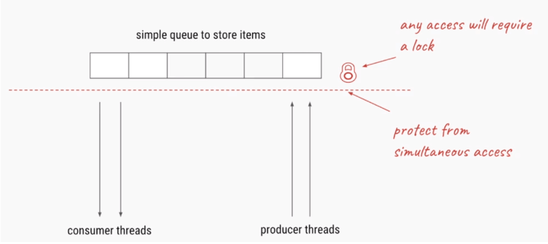

[TOC]


# 经典并发同步模式：生产者-消费者设计模式

​	在讨论基于阻塞队列的生产者消费者模式之前我们先搞清楚到底什么是生产者-消费者模式（producer-consumer模式）？

## 什么是生产者-消费者模式

比如有两个进程A和B，它们共享一个**固定大小的缓冲区**，A进程产生数据放入缓冲区，B进程从缓冲区中取出数据进行计算，那么这里其实就是一个生产者和消费者的模式，A相当于生产者，B相当于消费者


## 为什么要使用生产者消费者模式

在多线程开发中，如果生产者生产数据的速度很快，而消费者消费数据的速度很慢，那么生产者就必须等待消费者消费完了数据才能够继续生产数据，因为生产那么多也没有地方放啊；同理如果消费者的速度大于生产者那么消费者就会经常处理等待状态，所以为了达到生产者和消费者生产数据和消费数据之间的**平衡**，那么就需要一个缓冲区用来存储生产者生产的数据，所以就引入了生产者-消费者模式

简单来说这里的缓冲区的作用就是为了平衡生产者和消费者的处理能力，起到一个数据缓存的作用，同时也达到了一个解耦的作用

## 生产者-消费者模式的特点

- 保证生产者不会在缓冲区满的时候继续向缓冲区放入数据，而消费者也不会在缓冲区空的时候，消耗数据
- 当缓冲区满的时候，生产者会进入休眠状态，当下次消费者开始消耗缓冲区的数据时，生产者才会被唤醒，开始往缓冲区中添加数据；当缓冲区空的时候，消费者也会进入休眠状态，直到生产者往缓冲区中添加数据时才会被唤醒


## 生产者-消费者模式的应用场景

生产者-消费者模式一般用于将生产数据的一方和消费数据的一方分割开来，将生产数据与消费数据的过程解耦开来

- Excutor任务执行框架：
  - 通过将任务的提交和任务的执行解耦开来，提交任务的操作相当于生产者，执行任务的操作相当于消费者
  - 例如使用Excutor构建web服务器，用于处理线程的请求：生产者将任务提交给线程池，线程池创建线程处理任务，如果需要运行的任务数大于线程池的基本线程数，那么就把任务扔到阻塞队列（通过线程池+阻塞队列的方式比只使用一个阻塞队列的效率高很多，因为消费者能够处理就直接处理掉了，不用每个消费者都要先从阻塞队列中取出任务再执行）
- 消息中间件activeMQ: 
  - 双十一的时候，会产生大量的订单，那么不可能同时处理那么多的订单，需要将订单放入一个队列里面，然后由专门的线程处理订单。这里用户下单就是生产者，处理订单的线程就是消费者；再比如12306的抢票功能，先由一个容器存储用户提交的订单，然后再由专门处理订单的线程慢慢处理，这样可以在短时间内支持高并发服务
- 任务的处理时间比较长的情况下：
  - 比如上传附近并处理，那么这个时候可以将用户上传和处理附件分成两个过程，用一个队列暂时存储用户上传的附近，然后立刻返回用户上传成功，然后有专门的线程处理队列中的附近

## 生产者-消费者模式的优点

- 解耦：将生产者类和消费者类进行解耦，消除代码之间的依赖性，简化工作负载的管理
- 复用：通过将生产者类和消费者类独立开来，那么可以对生产者类和消费者类进行独立的复用与扩展
- 调整并发数：由于生产者和消费者的处理速度是不一样的，可以调整并发数，给予慢的一方多的并发数，来提高任务的处理速度
- 异步：对于生产者和消费者来说能够各司其职，生产者只需要关心缓冲区是否还有数据，不需要等待消费者处理完；同样的对于消费者来说，也只需要关注缓冲区的内容，不需要关注生产者，通过异步的方式支持高并发，将一个耗时的流程拆成生产和消费两个阶段，这样生产者因为执行put()的时间比较短，而支持高并发
- 支持分布式：生产者和消费者通过队列进行通讯，所以不需要运行在同一台机器上，在分布式环境中可以通过redis的list作为队列，而消费者只需要轮询队列中是否有数据。同时还能支持集群的伸缩性，当某台机器宕掉的时候，不会导致整个集群宕掉


## 生产者-消费者模式的实现

首先我们从最简单的开始，假设只有一个生产者线程执行put操作，向缓冲区中添加数据，同时也只有一个消费者线程从缓冲区中取出数据


UML实体关系图,从UML类图中可以看出，我们的producer和consumer类都持有一个对container对象的引用，这样的设计模式实际上在很多设计模式都有用到，比如我们的装饰者模式等等，它们共同的目的都是为了达到解耦和复用的效果


在实现生产者-消费者模式之前我们需要搞清两个问题：

- 如何保证容器中数据状态的一致性
- 如何保证消费者和生产者之间的同步和协作关系

1）容器中数据状态的一致性：当一个consumer执行了take()方法之后，此时容器为空，但是还没来得及更新容器的size,那么另外一个consumer来了之后以为size不等于0，那么继续执行take(),从而造成了了状态的不一致性

2）为了保证当容器里面没有数据的时候，消费者不会继续take，此时消费者释放锁，处于阻塞状态；并且一旦生产者添加了一条数据之后，此时重新唤醒消费者，消费者重新获取到容器的锁，继续执行take();

​	当容器里面满的时候，生产者也不会继续put, 此时生产者释放锁，处于阻塞状态；一旦消费者take了一条数据，此时应该唤醒生产者重新获取到容器的锁，继续put



所以对于该容器的任何访问都需要进行同步，也就是说在获取容器的数据之前，需要先获取到容器的锁。

而这里对于容器状态的同步可以参考如下几种方法：

- **Object**的wait() / notify()方法
- **Semaphore**的acquire()/release()方法
- **BlockingQueue**阻塞队列方法
- **Lock和Condition**的await() / signal()方法
- **PipedInputStream**/ **PipedOutputStream**

要构建一个生产者消费者模式，那么首先就需要构建一个固定大小的缓冲区，并且该缓冲区具有可阻塞的put方法和take方法

### 1、利用内部线程之间的通信：Object的wait() / notify()方法

接下来我们采用第一种方法来实现该模型：使用Object的wait() / notify()方法实现生产者-消费者模型

ps:采用wait()/notify()方法的缺点是不能实现单生产者单消费者模式，因为要是用notify()就必须使用同步代码块

#### 创建Container容器类

```java
package test1;

import java.util.LinkedList;

public class Container {
    LinkedList<Integer> list = new LinkedList<Integer>();
    int capacity = 10;

    public void put(int value){
        while (true){
            try {
                //sleep不能放在同步代码块里面，因为sleep不会释放锁，
                // 当前线程会一直占有produce线程，直到达到容量，调用wait()方法主动释放锁
                Thread.sleep(1000);
            } catch (InterruptedException e) {
                e.printStackTrace();
            }
            synchronized (this){
                //当容器满的时候，producer处于等待状态
                while (list.size() == capacity){
                    System.out.println("container is full,waiting ....");
                    try {
                        wait();
                    } catch (InterruptedException e) {
                        e.printStackTrace();
                    }
                }
                //没有满，则继续produce
                System.out.println("producer--"+ Thread.currentThread().getName()+"--put:" + value);
                list.add(value++);
                //唤醒其他所有处于wait()的线程，包括消费者和生产者
                notifyAll();
            }
        }
    }

    public Integer take(){
        Integer val = 0;
        while (true){
            try {
                Thread.sleep(1000);
            } catch (InterruptedException e) {
                e.printStackTrace();
            }
            synchronized (this){
                //如果容器中没有数据，consumer处于等待状态
                while (list.size() == 0){
                    System.out.println("container is empty,waiting ...");
                    try {
                        wait();
                    } catch (InterruptedException e) {
                        e.printStackTrace();
                    }
                }
                //如果有数据，继续consume
                val = list.removeFirst();
                System.out.println("consumer--"+ Thread.currentThread().getName()+"--take:" + val);

                //唤醒其他所有处于wait()的线程，包括消费者和生产者
                //notify必须放在同步代码块里面
                notifyAll();
            }
        }


    }

}

```

ps: 

- sleep()的位置

这里需要注意的是sleep()不能放在synchronized代码块里面，因为我们知道sleep()执行之后是不会释放锁的，也就是说当前线程仍然持有对container对象的互斥锁，这个时候当前线程继续判断list.size是否等于capacity，不等于就继续put,然后又sleep一会，然后又继续，直到当list.size == capacity,这个时候终于进入wait()方法，我们知道wait()方法会释放锁，这个时候其他线程才有机会获取到container的互斥锁，

- notifyAll()不能单独放在producer类里面，因为notifyAll（）必须放在同步代码块里面
- 弊端：这里由于不能区分哪些是not empty或者not full或者is full/empty线程，所以需要唤醒所有其他等待的线程，但实际上我们需要的是唤醒那些not empty或者not full的线程就够了

#### 创建生产者类

```java
package test1;
import test1.Container;
import java.util.Random;

public class Producer implements Runnable{
    private Container container;
    public Producer(Container container) {
        this.container = container;
    }
    @Override
    public void run() {
        container.put(new Random().nextInt(100));
    }
}

```

#### 创建消费者类

```java
package test1;
import java.util.Random;

public class Consumer implements Runnable{
    private Container container;
    public Consumer(Container container) {
        this.container = container;
    }

    @Override
    public void run() {
        Integer val = container.take();
    }
}

```

#### 测试类

```java
package test1;

import test1.Consumer;
import test1.Container;
import test1.Producer;

public class Main {
    public static void main(String[] args){
        Container container = new Container();

        Thread producer1 = new Thread(new Producer(container));
        Thread producer2 = new Thread(new Producer(container));
        Thread producer3 = new Thread(new Producer(container));
        Thread producer4 = new Thread(new Producer(container));
        producer1.start();
        producer2.start();
        producer3.start();
        producer4.start();

        Thread consumer1 = new Thread(new Consumer(container));
        Thread consumer2 = new Thread(new Consumer(container));
        Thread consumer3 = new Thread(new Consumer(container));
        Thread consumer4 = new Thread(new Consumer(container));
        Thread consumer5 = new Thread(new Consumer(container));
        Thread consumer6 = new Thread(new Consumer(container));
        consumer1.start();
        consumer2.start();
        consumer3.start();
        consumer4.start();
        consumer5.start();
        consumer6.start();
    }
}

```

运行结果

```java
producer--Thread-1--put:80
producer--Thread-2--put:19
producer--Thread-3--put:8
producer--Thread-0--put:74
consumer--Thread-8--take:80
consumer--Thread-4--take:19
consumer--Thread-6--take:8
consumer--Thread-9--take:74
container is empty,waiting ...
container is empty,waiting ...
producer--Thread-2--put:20
consumer--Thread-7--take:20
container is empty,waiting ...
producer--Thread-3--put:9
producer--Thread-1--put:81
producer--Thread-0--put:75
consumer--Thread-5--take:9
consumer--Thread-6--take:81
consumer--Thread-8--take:75
container is empty,waiting ...
container is empty,waiting ...
container is empty,waiting ...
```

### 2、利用信号量实现生产者-消费者模型

#### 思路

生产者消费者模型中的共享资源是一个固定大小的缓冲区，该模式需要当缓冲区满的时候，生产者不再生产数据，直到消费者消费了一个数据之后，才继续生产；同理当缓冲区空的时候，消费者不再消费数据，直到生产者生产了一个数据之后，才继续消费

如果要通过信号量来解决这个问题：关键在于找到能够跟踪缓冲区的size大小变化，并根据缓冲区的数量变化来控制消费者和生产者线程之间的协作和运行

那么很容易很够想到用两个信号量：empytyCount和fullCount分别来表示缓冲区满或者空的状态，进而能够更加容易控制消费者和生产者到底什么时候处于阻塞状态，什么时候处于运行状态

- emptyCount = N ; fullCount = 0 ; useQueue = 1

同时为了使得程序更加具有健壮性，我们还添加一个二进制信号量useQueue,确保队列的状态的完整性不受损害。例如当两个生产者同时向空队列添加数据时，从而破坏了队列内部的状态，使得其他计数信号量或者返回的缓冲区的size大小不具有一致性。（当然这里也可以使用mutex来代替二进制信号量）

```
produce:
    P(emptyCount)//信号量emptyCount减一
    P(useQueue)//二值信号量useQueue减一，变为0（其他线程不能进入缓冲区，阻塞状态）
    putItemIntoQueue(item)//执行put操作
    V(useQueue)//二值信号量useQueue加一，变为1（其他线程可以进入缓冲区）
    V(fullCount)//信号量fullCount加一
```

```
consume:
    P(fullCount)//fullCount -= 1
    P(useQueue)//useQueue -= 1(useQueue = 0)
    item ← getItemFromQueue()
    V(useQueue)//useQueue += 1 (useQueue = 1)
    V(emptyCount)//emptyCount += 1
```

ps:  这里的两个PV操作是否可以颠倒

- P操作不可以

  首先生产者获取到信号量emptyCount，执行P(emptyCount)，确保emptyCount不等于0，也就是还有空间添加数据，从而才能够进入临界区container

  然后执行put操作，执行put操作之前需要为缓冲区加把锁，防止在put的过程中，其他线程对缓冲区进行修改，所以这个时候需要获取另外一个信号量useQueue

  相反，如果先执行了 P(useQueue)，并且此时的emptyCount = 0，那么生产者就会一直阻塞，直到消费者消费了一个数据；但是此时消费者又无法获取到互斥信号量useQueue，也会一直阻塞，所以就形成了一个死锁

  所以这两个p操作是不能交换顺序的，信号量emptyCount是useQueue的基础和前提条件

- V操作可以

  此时如果生产者已经执行完put操作，那么可以先释放互斥信号量，再执行 V(fullCount)；或者先执行 V(fullCount)再释放互斥信号量都没有关系。不会对其他的生产者消费者的状态产生影响；但是最好的还是先释放互斥锁，再执行V(fullCount)，这样可以保证当容器满的时候，消费者能够及时的获取到互斥锁

#### 代码实现

Container

```java
package test3;

import java.util.LinkedList;
import java.util.List;
import java.util.concurrent.Semaphore;

public class Container {
    Semaphore fullCount = new Semaphore(0);
    Semaphore emptyCount = new Semaphore(10);
    Semaphore isUse = new Semaphore(1);

    List list = new LinkedList<Integer>();

    public void  put(Integer val){

        try {
            emptyCount.acquire();
            isUse.acquire();

            list.add(val);
            System.out.println("producer--"+ Thread.currentThread().getName()+"--put:" + val+"===size:"+list.size());

        } catch (InterruptedException e) {
            e.printStackTrace();
        }finally {
            isUse.release();
            fullCount.release();
        }
        try {
            Thread.sleep(1000);
        } catch (InterruptedException e) {
            e.printStackTrace();
        }

    }

    public Integer get(){
        Integer val1 = 0;
        try {
            fullCount.acquire();
            isUse.acquire();

             val1 = (Integer) list.remove(0);
            System.out.println("consumer--"+ Thread.currentThread().getName()+"--take:" + val1+"===size:"+list.size());

        } catch (InterruptedException e) {
            e.printStackTrace();
        }finally {
            isUse.release();
            emptyCount.release();
        }

       return val1;

    }
}

```

生产者

```java
package test3;

import java.util.Random;

public class Producer implements Runnable{
    private Container container;

    public Producer(Container container) {
        this.container = container;
    }

    @Override
    public void run() {
        while (true){

            container.put(new Random().nextInt(100));
        }
    }
}

```

消费者

```java
package test3;

public class Consumer implements Runnable{
    private Container container;

    public Consumer(Container container) {
        this.container = container;
    }

    @Override
    public void run() {
        while (true){
            Integer val = container.get();

        }
    }
}

```

测试

```java
package test3;

public class Test {
    public static void main(String[] args){

        Container container = new Container();

        Thread producer1 = new Thread(new Producer(container));
        Thread producer2 = new Thread(new Producer(container));
        Thread producer3 = new Thread(new Producer(container));

        Thread consumer1 = new Thread(new Consumer(container));
        Thread consumer2 = new Thread(new Consumer(container));
        Thread consumer3 = new Thread(new Consumer(container));
        Thread consumer4 = new Thread(new Consumer(container));

        producer1.start();
        producer2.start();
        producer3.start();

        consumer1.start();
        consumer2.start();
        consumer3.start();
        consumer4.start();

    }
}

```

```
producer--Thread-0--put:74===size:1
producer--Thread-4--put:16===size:2
producer--Thread-2--put:51===size:3
producer--Thread-1--put:77===size:4
producer--Thread-3--put:93===size:5
consumer--Thread-6--take:74===size:4
consumer--Thread-6--take:16===size:3
consumer--Thread-6--take:51===size:2
consumer--Thread-6--take:77===size:1
consumer--Thread-5--take:93===size:0
producer--Thread-4--put:19===size:1
producer--Thread-3--put:68===size:2
producer--Thread-0--put:72===size:3
consumer--Thread-6--take:19===size:2
consumer--Thread-6--take:68===size:1
consumer--Thread-5--take:72===size:0
producer--Thread-1--put:82===size:1
producer--Thread-2--put:32===size:2
consumer--Thread-5--take:82===size:1

```

### 3、基于阻塞队列的生产者消费者模型

由于这里的缓冲区由BlockingQueue容器代替，那么这里我们就不需要重新创建一个容器类了，直接创建生产者类和消费者类，并且同样的都需要拥有一个容器类BlockingQueue的实例应用

#### 创建生产者类

```java
package test;

import java.util.Random;
import java.util.concurrent.ArrayBlockingQueue;

public class Producer implements Runnable{
    private ArrayBlockingQueue<Integer> queue ;

    public Producer(ArrayBlockingQueue<Integer> queue) {
        this.queue = queue;
    }

    @Override
    public void run() {
        Random random = new Random();
        while (true){
           try {
               Thread.sleep(100);
               if(queue.size() == 10) System.out.println("================the queue is full,the producer thread is waiting..................");
               int item = random.nextInt(100);
               queue.put(item);
               System.out.println("producer:" + Thread.currentThread().getName() + " produce:" + item+";the size of the queue:" + queue.size());
           } catch (InterruptedException e) {
               e.printStackTrace();
           }
       }
    }
}

```

#### 创建消费者类

```java
package test;

import java.util.concurrent.ArrayBlockingQueue;

public class Consumer implements Runnable {
    private ArrayBlockingQueue<Integer> queue;

    public Consumer(ArrayBlockingQueue<Integer> queue) {
        this.queue = queue;
    }

    @Override
    public void run() {
       while (true){
           try {
               Thread.sleep(100);
               if(queue.size() == 0) System.out.println("=============the queue is empty,the consumer thread is waiting................");
               Integer item = queue.take();
               System.out.println("consumer:" + Thread.currentThread().getName() + " consume:" + item+";the size of the queue:" + queue.size());
           } catch (InterruptedException e) {
               e.printStackTrace();
           }
       }

    }
}

```

#### 测试类

```java
package test;

import java.util.concurrent.ArrayBlockingQueue;

public class Test {
    public static void main(String[] args){

        ArrayBlockingQueue<Integer> queue = new ArrayBlockingQueue<Integer>(10);
        Thread producer1 = new Thread(new Producer(queue));
        Thread producer2 = new Thread(new Producer(queue));
        Thread producer3 = new Thread(new Producer(queue));
        Thread producer4 = new Thread(new Producer(queue));
        Thread producer5 = new Thread(new Producer(queue));
        producer1.start();
        producer2.start();
        producer3.start();
        producer4.start();
        producer5.start();

        Thread consumer1 = new Thread(new Consumer(queue));
        Thread consumer2 = new Thread(new Consumer(queue));
        consumer1.start();
        consumer2.start();

        try {
            producer1.join();
            producer2.join();
            producer3.join();
            producer4.join();
            producer5.join();
            consumer1.join();
            consumer2.join();
        } catch (InterruptedException e) {
            e.printStackTrace();
        }
    }
}

```

```java
=============the queue is empty,the consumer thread is waiting................
consumer:Thread-5 consume:64;the size of the queue:0
producer:Thread-3 produce:64;the size of the queue:1
consumer:Thread-6 consume:87;the size of the queue:0
producer:Thread-1 produce:1;the size of the queue:3
producer:Thread-4 produce:87;the size of the queue:2
producer:Thread-2 produce:71;the size of the queue:2
producer:Thread-0 produce:76;the size of the queue:1
consumer:Thread-6 consume:71;the size of the queue:2
producer:Thread-1 produce:26;the size of the queue:6
producer:Thread-3 produce:6;the size of the queue:6
producer:Thread-0 produce:76;the size of the queue:5
producer:Thread-2 produce:37;the size of the queue:6

```

### 4、Lock和Condition的await() / signal()方法

在用Lock和Condition的await()/signal()方法实现生产者消费者之前，我们先来了解一下Lock和synchronized都是基于锁有哪些区别，以及Condition的await()/signal()方法和Object的wait()/notify()方法都是等待和唤醒又有哪些区别

#### Lock和synchronized的区别

| 锁机制             | Lock                                                         | synchronized                                                 |
| ------------------ | ------------------------------------------------------------ | ------------------------------------------------------------ |
| 所属层次           | **java.util.concurrent** package中的一个接口                 | 是一个关键字，JVM内置的语言实现                              |
| 释放锁与加锁       | 通过lock()/unlock()进行手动释放与加锁                        | 不需要，进入synchronized同步代码块就自动获取锁，退出同步代码块自动释放锁 |
| 设置超时时间       | trylock(timeout)                                             | 没有超时时间，线程会一直阻塞，直到获取锁                     |
| 公平机制           | 设置true,为公平锁，等待时间最长的先获取                      | 没有                                                         |
| 阻塞线程列表       | 可以查看正处于等待状态的线程列表                             | 不可以                                                       |
| 遇到异常时释放     | 当遇到异常时在finally中执行unlock()                          | 遇到异常时释放锁                                             |
| 底层实现           | 乐观锁方式（cas），每次不加锁而是假设没有冲突而去完成某项操作 | CPU悲观锁机制，即线程获得的是独占锁，只能依靠阻塞来等待线程释放锁 |
| 具体唤醒某一个线程 | ReentrantLock里面的Condition应用，能够控制signal哪个线程     | 不能控制具体notify哪个线程，notifyall()唤醒所有线程          |
| 灵活性             | 比synchronized更加灵活                                       | 不是那么灵活                                                 |
| 响应中断           | 等待的线程可以响应中断                                       | 不能响应中断                                                 |
| 应用场景           | 资源竞争激烈的情况下，是synchronized的几十倍                 | 资源竞争不激烈时，优于Lock                                   |

#### Condition的await()/signal()方法和Object的wait()/notify()方法

| 方法           | Condition             | Object                                              |
| -------------- | --------------------- | --------------------------------------------------- |
| 阻塞等待       | await()               | wait()                                              |
| 唤醒其他线程   | signal()              | notify()/notifyall()                                |
| 使用的锁       | 互斥锁/共享锁，如Lock | 同步锁:如synchronized                               |
| 一个锁对应     | 可以创建多个condition | 对应一个Object                                      |
| 唤醒指定的线程 | 明确的指定线程        | 只能通过notifyAll唤醒所有线程；或者notify()随机唤醒 |

#### lock和condition实现生产者消费者

该实现方式相比较synchronized于object的wait()/notify()方法具有更加的灵活性，可以唤醒具体的消费者线程或者生产者线程，达到当缓冲区满的时候，唤醒消费者线程，此时生产者线程都将被阻塞，而不是向notifyall()那样唤醒所有的线程。

##### 容器类

```java
package test8;

import java.util.LinkedList;
import java.util.List;
import java.util.Vector;
import java.util.concurrent.locks.Condition;
import java.util.concurrent.locks.Lock;
import java.util.concurrent.locks.ReentrantLock;

public class Container{
    private final Lock lock = new ReentrantLock();
    //表示生产者线程
    private final Condition notFull = lock.newCondition();
    //表示消费者线程
    private final Condition notEmpty = lock.newCondition();
    private int capacity;
    private List<Integer> list = new LinkedList<>();

    public Container(int capacity) {
        this.capacity = capacity;

    }

    public Integer take(){
        lock.lock();
       try {
           while (list.size() == 0)
               try {
                   System.out.println("the list is empty........");
                   notEmpty.await();//阻塞消费者线程
               } catch (InterruptedException e) {
                   e.printStackTrace();
               }
           Integer val = list.remove(0);
           System.out.println("consumer--"+ Thread.currentThread().getName()+"--take:" + val+"===size:"+list.size());

           notFull.signalAll();//唤醒所有生产者线程
           return val;
       }finally {
           lock.unlock();
       }
    }

    public void put(Integer val){
        lock.lock();
       try {
           while (list.size() == capacity){
               try {
                   System.out.println("the list is full........");

                   notFull.await();//阻塞生产者线程
               } catch (InterruptedException e) {
                   e.printStackTrace();
               }
           }
           list.add(val);
           System.out.println("producer--"+ Thread.currentThread().getName()+"--put:" + val+"===size:"+ list.size());

           notEmpty.signalAll();//唤醒所有消费者线程
       }finally {
           lock.unlock();
       }

        try {
            Thread.sleep(1000);
        } catch (InterruptedException e) {
            e.printStackTrace();
        }
    }


}

```

##### 生产者

```java
package test8;

import java.util.Random;
import java.util.TreeMap;
import java.util.concurrent.locks.Condition;

public class Producer implements Runnable {

    private Container container;

    public Producer(Container container) {
        this.container = container;
    }

    @Override
    public void run() {
        while (true){

            container.put(new Random().nextInt(100));
        }
    }
}

```

##### 消费者

```java
package test8;

public class Consumer implements Runnable {

    private Container container;

    public Consumer(Container container) {
        this.container = container;
    }

    @Override
    public void run() {
        while (true){
            Integer val = container.take();
        }
    }
}

```

##### 测试类

```java
package test8;

public class Test {
    public static void main(String[] args){

        Container container = new Container(5);

        Thread producer1 = new Thread(new Producer(container));
        Thread producer2 = new Thread(new Producer(container));
        Thread producer3 = new Thread(new Producer(container));
        Thread producer4 = new Thread(new Producer(container));
        Thread producer5 = new Thread(new Producer(container));

        Thread consumer1 = new Thread(new Consumer(container));
        Thread consumer2 = new Thread(new Consumer(container));


        producer1.start();
        producer2.start();
        producer3.start();
        producer4.start();
        producer5.start();

        consumer1.start();
        consumer2.start();
    }
}

```

```
the list is empty........
producer--Thread-3--put:77===size:1
consumer--Thread-6--take:77===size:0
the list is empty........
producer--Thread-4--put:55===size:1
producer--Thread-0--put:62===size:2
producer--Thread-1--put:90===size:3
producer--Thread-2--put:57===size:4
consumer--Thread-5--take:55===size:3
consumer--Thread-5--take:62===size:2
consumer--Thread-5--take:90===size:1
consumer--Thread-5--take:57===size:0
the list is empty........
the list is empty........
producer--Thread-0--put:10===size:1
producer--Thread-1--put:21===size:2
producer--Thread-3--put:3===size:3
producer--Thread-4--put:75===size:4
producer--Thread-2--put:94===size:5
consumer--Thread-5--take:10===size:4
```

## 不同模式的生产者消费者模型

### 1、单生产者单消费者(SPSC)（只有同步没有互斥）

#### 使用信号量实现

对于单生产者单消费者，只用保证缓冲区满的时候，生产者不会继续向缓冲区放数据，缓冲区空的时候，消费者不会继续从缓冲区取数据，而不存在同时有两个生产者使用缓冲区资源，造成数据不一致的状态。

所以对于单生产者单消费者，如果采用信号量模型来实现的话，那么只需要两个信号量：empytyCount和fullCount分别来表示缓冲区满或者空的状态，进而能够更加容易控制消费者和生产者到底什么时候处于阻塞状态，什么时候处于运行状态;  而不需要使用互斥信号量了

- emptyCount = N ; fullCount = 0 ; 

```
produce:
    P(emptyCount)//信号量emptyCount减一
    putItemIntoQueue(item)//执行put操作
    V(fullCount)//信号量fullCount加一
```

```
consume:
    P(fullCount)//fullCount -= 1
    item ← getItemFromQueue()
    V(emptyCount)//emptyCount += 1
```

实现

缓冲区容器类

```java
package test9;

import java.time.temporal.ValueRange;
import java.util.LinkedList;
import java.util.List;
import java.util.concurrent.Semaphore;

public class Container_spsc {
    Semaphore emptyCount = new Semaphore(10);
    Semaphore fullCount = new Semaphore(0);

    List<Integer> list = new LinkedList<Integer>();

    public void put(int val){
        try {
            emptyCount.acquire();
            list.add(val);
            System.out.println("producer--"+ Thread.currentThread().getName()+"--put:" + val+"===size:"+list.size());
        } catch (InterruptedException e) {
            e.printStackTrace();
        }finally {
            fullCount.release();
        }
        try {
            Thread.sleep(1000);
        } catch (InterruptedException e) {
            e.printStackTrace();
        }
    }

    public Integer take(){
        Integer val = 0;

        try {
            fullCount.acquire();
             val = list.remove(0);
            System.out.println("consumer--"+ Thread.currentThread().getName()+"--take:" + val+"===size:"+list.size());

        } catch (InterruptedException e) {
            e.printStackTrace();
        }finally {
            emptyCount.release();
        }
        return val;
    }

}

```

生产者

```java
package test9;

import test8.Container;

import java.util.Random;

public class Producer implements Runnable {

    private Container_spsc container;

    public Producer(Container_spsc container) {
        this.container = container;
    }

    @Override
    public void run() {
        while (true){
            container.put(new Random().nextInt(100));
        }
    }
}

```

消费者类

```java
package test9;

import test8.Container;

public class Consumer implements Runnable {

    private Container_spsc container;

    public Consumer(Container_spsc container) {
        this.container = container;
    }

    @Override
    public void run() {
        while (true){
            Integer take = container.take();
        }
    }
}

```

测试

```java
package test9;

public class Test {
    public static void main(String[] args){

        Container_spsc container = new Container_spsc();
        Thread producer = new Thread(new Producer(container));
        Thread consumer = new Thread(new Consumer(container));

        producer.start();
        consumer.start();

    }
}

```

```java
producer--Thread-0--put:62===size:1
consumer--Thread-1--take:62===size:0
producer--Thread-0--put:40===size:1
consumer--Thread-1--take:40===size:0
producer--Thread-0--put:86===size:1
consumer--Thread-1--take:86===size:0
producer--Thread-0--put:15===size:1
consumer--Thread-1--take:15===size:0
producer--Thread-0--put:83===size:1
consumer--Thread-1--take:83===size:0
producer--Thread-0--put:13===size:1
consumer--Thread-1--take:13===size:0
```

### 2、多生产者单消费者（MPSC）

对于多生产者单消费者来说，多生产者之间具有互斥关系，所以这里需要一个互斥锁来实现缓冲区的互斥访问，那么具体的实现方式就是在单生产者单消费者的基础之上，加一个互斥信号量useQueue

如果采用信号量来实现的话可以如下：

- emptyCount = N ; fullCount = 0 ; useQueue = 1

```
produce:
    P(emptyCount)//信号量emptyCount减一
    P(useQueue)//二值信号量useQueue减一，变为0（其他线程不能进入缓冲区，阻塞状态）
    putItemIntoQueue(item)//执行put操作
    V(useQueue)//二值信号量useQueue加一，变为1（其他线程可以进入缓冲区）
    V(fullCount)//信号量fullCount加一
```

```
consume:
    P(fullCount)//fullCount -= 1   
    item ← getItemFromQueue()
    V(emptyCount)//emptyCount += 1
```

具体的实现和单生产者单消费者差不多，只不过在生产者类里面多加了一个互斥信号量useQueue

### 3、单生产者多消费者（SPMC）

对于单生产者多消费者同多生产者多消费者

- emptyCount = N ; fullCount = 0 ; useQueue = 1

```
produce:
    P(emptyCount)//信号量emptyCount减一
    putItemIntoQueue(item)//执行put操作
    V(fullCount)//信号量fullCount加一
```

```
consume:
    P(fullCount)//fullCount -= 1   
    P(useQueue)//二值信号量useQueue减一，变为0（其他线程不能进入缓冲区，阻塞状态）
    item ← getItemFromQueue()
    V(useQueue)//二值信号量useQueue加一，变为1（其他线程可以进入缓冲区）
    V(emptyCount)//emptyCount += 1
```

具体的实现和单生产者单消费者差不多，只不过在消费者类里面多加了一个互斥信号量useQueue

### 4、多生产者多消费者（MPMC）-单缓冲区(SB)

对于多生产者多消费者问题，是一个同步+互斥问题，不仅需要生产者和消费者之间的同步协作，还需要实现对缓冲区资源的互斥访问；这个可以参考前面对生产者消费者4种实现方式

采用信号量

- emptyCount = N ; fullCount = 0 ; useQueue = 1

```
produce:
    P(emptyCount)//信号量emptyCount减一
    P(useQueue)//二值信号量useQueue减一，变为0（其他线程不能进入缓冲区，阻塞状态）
    putItemIntoQueue(item)//执行put操作
    V(useQueue)//二值信号量useQueue加一，变为1（其他线程可以进入缓冲区）
    V(fullCount)//信号量fullCount加一
```

```
consume:
    P(fullCount)//fullCount -= 1   
    P(useQueue)//二值信号量useQueue减一，变为0（其他线程不能进入缓冲区，阻塞状态）
    item ← getItemFromQueue()
    V(useQueue)//二值信号量useQueue加一，变为1（其他线程可以进入缓冲区）
    V(emptyCount)//emptyCount += 1
```

### 5、多生产者多消费者（MPMC）-双缓冲区(MB)

- **为什么要用双缓冲区**：**读写分离减少释放锁和获取锁的开销**

用一个缓冲区，生产者和消费者需要先获取到缓冲区的锁才能进行put和take操作，每一次put和take都需要获取一次锁，这需要大量的同步与互斥操作，十分损耗性能。

所以如果采用双缓冲区的话，一个缓冲区bufferA用于生产者执行put操作，一个缓冲区bufferB用于消费者执行take操作；生产者线程和消费者线程在使用各自的缓冲区之前都需要先获取到缓冲区对应的锁，才能进行操作；

生产者和消费者各自使用自己独立的缓冲区，那么就不存在同一个缓冲区被put的同时进行take操作

所以一旦生产者和消费者一旦获取到了对应缓冲区的锁，那么每一次执行put/take操作时就不用再次重新获取锁了，从而减少了很多获取锁、释放锁的性能开销

- **缓冲区的切换**

如果bufferA被put满了，那么生产者释放bufferA的锁，并等待消费者释放bufferB的锁；当bufferB被take空了，消费者释放bufferB的锁，此时生产者获取到bufferB的锁，对bufferB进行put;消费者获取到bufferA的锁，对bufferA进行take,那么就完成了一次缓冲区的切换

- **双缓冲区的状态**

  - **并发读写**

    bufferA和bufferB都处于工作状态，一个读一个写

  - **单个缓冲区空闲**

    假设bufferA已经满了，那么生产者就会释放bufferA的锁，尝试获取bufferB，而此时bufferB还在执行take操作，消费者还没释放bufferB的锁，那么生产者进入等待状态

  - **缓冲区的切换**

    当bufferB为空，那么此时消费者释放bufferB的锁，尝试获取bufferA的锁，此时消费者被唤醒，重新尝试获取bufferB的锁

- **双缓冲区的死锁问题**

  如果操作完当前的缓冲区之后，先获取另外一个缓冲区的锁，再释放当前缓冲区的锁，就会发生死锁问题。如果bufferA和bufferB的线程同时尝试获取对方的锁，那么就会一直循环等待下去

- **需要注意的问题**

  由于双缓冲区是为了避免每次读写的时候不用进行同步与互斥操作，所以对于一些本来就是线程安全的类例如arrayblockingqueue就不适合作为双缓冲区，因为他们内部已经实现了每次读写操作的时候进行加锁和释放

- 应用场景：
  - **共享内存和共享文件**
  - **逻辑处理线程和IO处理线程分离**。 I/0处理线程负责网络数据的发送和接收，连接的建立和维护。 逻辑处理线程处理从IO线程接收到的包。

### 6、多生产者多消费者（MPMC）-多缓冲区(MB)

多个缓冲区构成一个缓冲池，同样需要两个同步信号量emtpyCount和fullCount，还有一个互斥信号量useQueue,同时还需要两个变量指示哪些是空缓冲区哪些是有数据的缓冲区，多缓冲区和双缓冲区一样，同样是以空间换时间，减少单个读写操作的同步与互斥操作，对于同一个缓冲区而言，不可能同时会put和take

### 7、多生产者多消费者(MPMC)-环形缓冲区（Ring buffer）

#### 为什么要引入环形缓冲区

讨论为什么要引入环形缓冲区，其实也就是在讨论队列缓冲区有什么弊端，而环形缓冲区是如何解决这种弊端的=

那么我们先认识一下什么是环形缓冲区

- 循环缓冲区的有用特性是，当使用一个循环缓冲区时，它不需要将其元素打乱。
- FIFO
- 所有的 push/pop 操作都是在一个固定的存储空间内进行，少掉了对于缓冲区元素所用存储空间的分配、释放

队列缓冲区

- 如果使用非循环缓冲区，那么在使用一个缓冲区时，需要移动所有元素
- LIFO
- 在执行push和pop操作时，涉及到内存的分配与释放开销大


了解了如何使用Java通过简单的synchronized与object的wait()/notify()、Lock与Condition的await()/signal()方法、BlockingQueue、信号量semaphore四种方法来实现生产者消费者模型，以后有机会我们在研究研究Linux和windows分别又是如何实现生产者消费者模型的

## 参考

《Java并发编程实践》

[实现生产者消费者模式的四种方式（Synchronized、Lock、Semaphore、BlockingQueue）](https://segmentfault.com/a/1190000016260650)

[**生产者消费者模型你知道多少**](https://blog.csdn.net/luohuacanyue/article/details/14648185)

[**多任务并发之生产者消费者模式应用**](https://blog.csdn.net/guozebo/article/details/51185250)

[聊聊并发——生产者消费者模式](https://www.cnblogs.com/yiliweichinasoft/p/3717792.html)

[**经典消费者生产者问题**](https://blog.csdn.net/m0_37922390/article/details/78864948)

https://blog.csdn.net/luohuacanyue/article/details/14648185

https://www.geeksforgeeks.org/producer-consumer-solution-using-threads-java/

[【Java】生产者消费者模式的实现](https://itimetraveler.github.io/2017/11/10/%E3%80%90Java%E3%80%91%E7%94%9F%E4%BA%A7%E8%80%85%E6%B6%88%E8%B4%B9%E8%80%85%E6%A8%A1%E5%BC%8F%E7%9A%84%E5%AE%9E%E7%8E%B0/)

[信号量（生产者和消费者模型）](https://blog.csdn.net/xy913741894/article/details/70990756)

[线程通信](http://ifeve.com/thread-signaling/)

https://www.geeksforgeeks.org/producer-consumer-solution-using-semaphores-java/

https://blog.csdn.net/chenchaofuck1/article/details/51592429

https://www.cnblogs.com/Wanted-Tao/p/6378942.html

https://blog.csdn.net/u012403290/article/details/64910926

https://www.geeksforgeeks.org/lock-framework-vs-thread-synchronization-in-java/

https://blog.csdn.net/woailuo453786790/article/details/51436799

https://blog.csdn.net/liuxiao723846/article/details/80436246

https://program-think.blogspot.com/2009/04/producer-consumer-pattern-4-double.html

https://zhuanlan.zhihu.com/p/56172285
